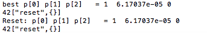
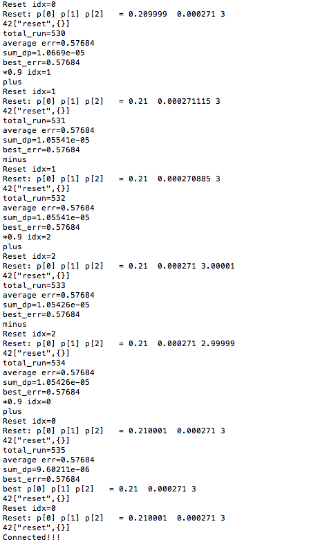
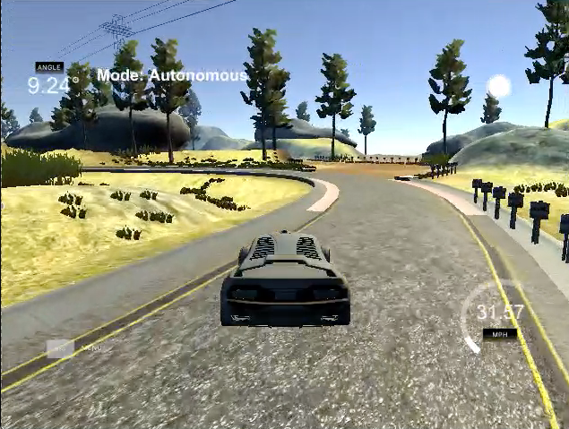

# 无人驾驶(纳米学位)-第二学期-项目3-PID 控制器
# CarND-Term2-Project3-PID_Controller (C++)

This is the 3rd project in Term 2 for the **Self-Driving Car Engineer** Nanodegree program at [Udacity](https://cn.udacity.com/course/self-driving-car-engineer--nd013)

### Goals
In this project, the goal is to implement a PID controller in C++ to maneuver the vehicle around the lake race track.

### The project directory structure:
```
root
|   CMakeLists.txt
|   cmakepatch.txt
|   README.md
|
|___Results
|
|___src
    |   json.hpp
    |   main.cpp
    |   PID.cpp
    |   PID.h
```

### Basic Build Instructions
The main program can be built and ran by doing the following from the project top directory. 

1. Make a build directory: `mkdir build && cd build`
3. Compile: `cmake .. && make`
4. Run it: `./pid`. 

I compliled the project on **MacOS 10.14.5 with g++-9**:  
g++-9 (Homebrew GCC 9.2.0_1)  9.2.0


# Implementations
PID represents **Proportion**, **Integral**, **Differential**, these represent three control algorithms, and the combination of the three algorithms can effectively correct the deviation of the controlled object, so that it reaches a stable state.

Because the simulator provides the cross track error (CTE) , I implemented the following to implement the PID controller, which can compute the appropriate steering value for the vehicle, i.e. the `total_error` as output of the algorithms.

## 1. The PID class
This is implemented in `PID.cpp` and `PID.h`

where functions are：
- `void PID::Init(double Kp_, double Ki_, double Kd_)`
- `void PID::UpdateError(double cte)`
- `double TotalError()`

The implementations are quite straight forward:
- Init hyperparameters: **Kp, Ki, Kd**, for a PID controller  
- Update 3 parts of total errors,  **proportional error (`p_error`), intergral error(`i_error`) and differential error(`d_error`)** when receiving a new cross track error(CTE) 
- Compute the total_error , it is actually the 'response' to the errors, i.e. the steering angle for the vehicle:  
`total_error = - Kp * p_error - Ki * i_error - Kd * d_error`

## 2. The twiddle algorithm
The sample implementation of twiddle algorithm seems quite simple and easy to understand in the course. But with a simulator, it took me lots of time trying to figure out **the order and relationship of the functions and actions**, for examples:
- when to **initialize** the PID controller and when to **reset** it
- when to **initialize** the parameters and a bunch of variables (`p[], dp[], err, best_err, idx , i etc.`) and when to **update** or **reset** them
- how to **maintain the values** of some variables for each call of `h.onMessage()` , either passed by reference such as `&pid` ,`&p[]`, or using `static` declarations
- when to run a loop of trials and calculate the average error
- when to check **stop** condition , such as `sum_dp`

I implemented the twiddle algorithm in `main.cpp`, the main parts include:
- **init_twiddle** `line #106~line#119` :  only run once at the begining
- **One loop of trials** `line #124~line#141`: run N iterations to obtain accumulated errors and calcuate an average error for later check
- **Check stop condition** `line #146~line#156`: check if the PID controller's coefficients/parameters are almost not updated any more since dp values are very small
- **Update the PID coefficients** : `line #157~line#202`:  tune each coefficient (i.e Kp, Ki, Kd in `p[]`) respectively. This is the **Most brain twisting** part, I checked some sample code again and again,and finally my solution uses 2 switch variables (`plus` and `minus`) to control the work flow. There might be better solutions.
- **Reset** `line #205~line#216`:  reset variables such as `err` , `i` , re-initialize the PID controller,  and send `reset` message to simulator, let it start a new loop of trails on newly updated `p[]` to see if any improvement

## 3. Hyperparameters
**Kp, Ki, Kd** are 3 hyperparameters of the PID controller.  In this project, the hyperparameters are data members in the PID class. They are also stored in `p[]` where `Kp = p[0], Ki = p[1], Kd = p[2]`
```
 /**
   * PID Coefficients
   */ 
  double Kp;
  double Ki;
  double Kd;
```

### **1) Many Trials and fails**  

**Our goal** is to find appropriate `p[]` to initialize the PID controller. **With the twiddle** algorithm, I tried many combinations, for ex. started with `p[]={0,0,0}` and using `dp[] = {1,1,1}` , but results were not very good.



I then tried using the combination of `p[]={0.2, 0.001, 3.0}` (comes from the course exercise) and found it already works! I finally just **fine tuned** the parameters starting with it.

### **2) Final Working Hyperparameters**
`line#49 ~line#52 in main.cpp`  
```
double p[] = {0.210001,  0.000271, 3.0}; // Run Final
//double p[] = {0.217218 , 0.001, 3.0};  // Run OK
//double p[] = {0.21, 0.0004, 3.081};    // Best Run 
//double p[] = {0.2, 0.0003, 3.0};       // Run OK mentor suggested  
``` 
The `{0.210001,  0.000271, 3.0}` was the result by running my twiddle starting with `p[] = {0.2, 0.001, 3.0}` and using `dp[] = {0.01, 0.001, 0.1}`.




### **3) Learn More about Hyperpameters**

- **Kp** 
This parameter makes the controller **proportionally respond to the CTE**,  the smaller Kp, the smaller control effect, the slower response, conversely the larger Kp, the stronger effect, and the faster response.  Notice that a large Kp may lead to severe overshoot and oscillations, it may also result in steady-state errors, i.e. residual errors can't be diminished.

- **Ki**  
This parameters controls response to **the integral(accumulated) errors**, it can help eleminate the steady-state errors. The larger Ki, the sooner the response, but it may lead to oscillations as well. The smaller Ki， the longer time the controller responds to the errors and can't make effect timely

For example, with a relative large `Kp (0.5)` and a very small `Ki (0.00004)`, the vehicle started with some large oscillations(when the video begins), but since the Ki is too small , it took a while before it seems generate some effects (at the end of video, the oscillations seem smaller)

 (if the video can't run, please check ./Results/Video/Run-0.5-0.00004-3.0-Out.mp4)
<video id="video" controls="" preload="none" poster="./Results/Result-0.5-0.00004-3.0-Out.png">
<source id="mp4" src="./Results/Video/Run-0.5-0.00004-3.0-Out.mp4" type="video/mp4">
</video>

- **Kd**  
The Kd parameter controls response to the change trend (rate of change) of the CTE，i.e. **the differencial part**.  It can help reduce overshoot and oscillation. If it is too small, it can't make effect.

For example. with Kp = 0.2, Ki = 0.001, Kd =1.0 , the vehicle ran well at the begining, but later went aside of the track



# My Running Results
My solution with `p[]={0.210001,  0.000271, 3.0}` was tested on the simulator and the vehicle is able to drive successfully around the track. 

(if the video can't run, please check ./Results/Video/Run-Final.mp4)  
<video id="video" controls="" preload="none" poster="./Results/Good.png">
<source id="mp4" src="./Results/Video/Run-Final.mp4" type="video/mp4">
</video>

## Issues and Possible Improvements
I think the above solution is not perfect, the twiddle algorithm many need further study, and hyperparameters can be further fine tuned to make the vehicle run more smoothly.

# Appendix
### Environment Setup
The project involves the Term 2 Simulator which can be downloaded [here](https://github.com/udacity/self-driving-car-sim/releases)

To run the simulator on Mac/Linux, first make the binary file executable with the following command:
```shell
sudo chmod u+x {simulator_file_name}
```

### Dependencies

* cmake >= 3.5
 * All OSes: [click here for installation instructions](https://cmake.org/install/)
* make >= 4.1(mac, linux), 3.81(Windows)
  * Linux: make is installed by default on most Linux distros
  * Mac: [install Xcode command line tools to get make](https://developer.apple.com/xcode/features/)
  * Windows: [Click here for installation instructions](http://gnuwin32.sourceforge.net/packages/make.htm)
* gcc/g++ >= 5.4
  * Linux: gcc / g++ is installed by default on most Linux distros
  * Mac: same deal as make - [install Xcode command line tools]((https://developer.apple.com/xcode/features/)
  * Windows: recommend using [MinGW](http://www.mingw.org/)
* [uWebSockets](https://github.com/uWebSockets/uWebSockets)
  * Run either `./install-mac.sh` or `./install-ubuntu.sh`.
  * If you install from source, checkout to commit `e94b6e1`, i.e.
    ```
    git clone https://github.com/uWebSockets/uWebSockets 
    cd uWebSockets
    git checkout e94b6e1
    ```
    Some function signatures have changed in v0.14.x. See [this PR](https://github.com/udacity/CarND-MPC-Project/pull/3) for more details.
* Simulator. You can download these from the [project intro page](https://github.com/udacity/self-driving-car-sim/releases) in the classroom.

Fellow students have put together a guide to Windows set-up for the project [here](https://s3-us-west-1.amazonaws.com/udacity-selfdrivingcar/files/Kidnapped_Vehicle_Windows_Setup.pdf) if the environment you have set up for the Sensor Fusion projects does not work for this project. There's also an experimental patch for windows in this [PR](https://github.com/udacity/CarND-PID-Control-Project/pull/3).


